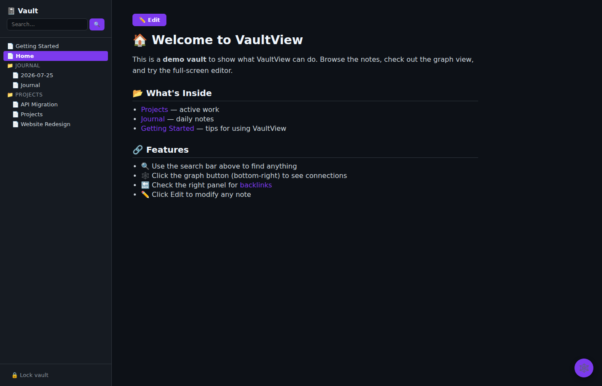
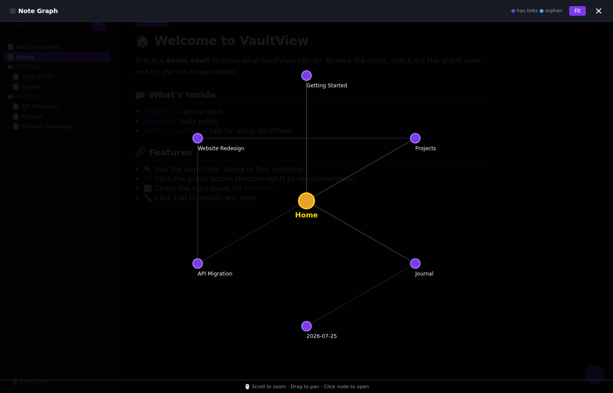
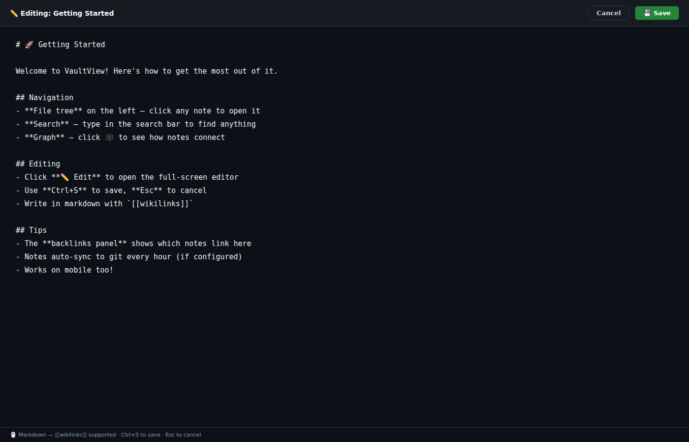
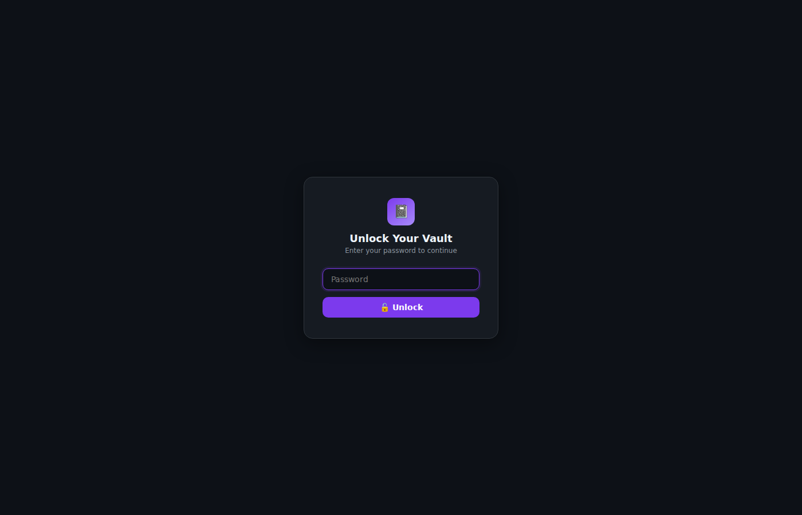
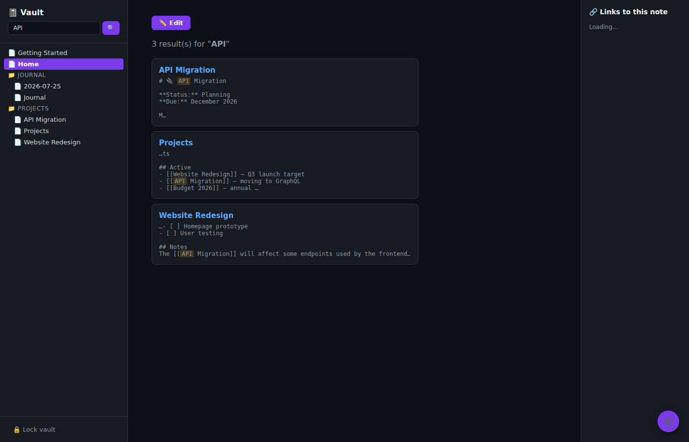
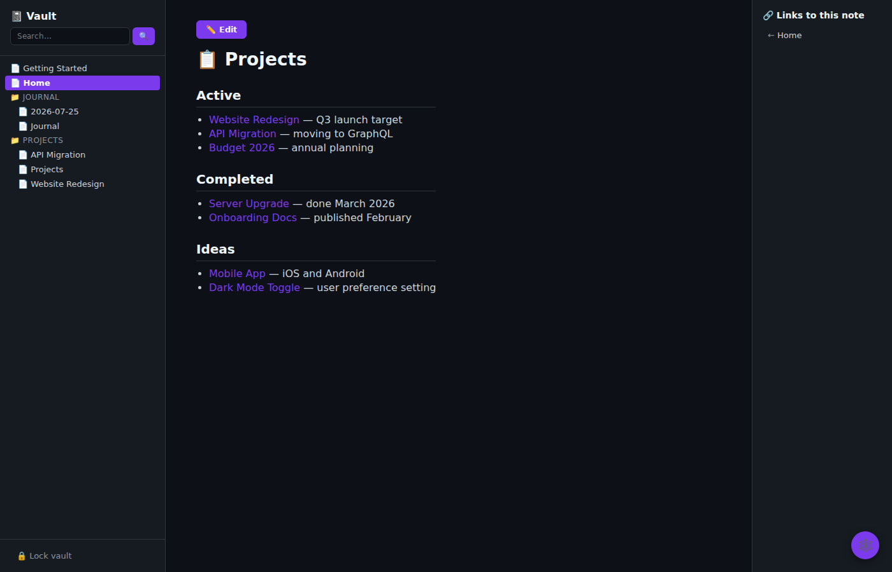

# VaultView

A lightweight, self-hosted web viewer and editor for [Obsidian](https://obsidian.md) vaults. Browse, search, edit, and visualize your notes — from any browser.


---

## Features

- 📁 **Nested file tree** — folders expand/collapse, reflects vault structure
- 🔗 **[[Wikilink]] support** — clickable internal links, self-links highlighted
- 🔙 **Backlinks panel** — see which notes link to the current one (auto-hides when empty)
- 🔍 **Full-text search** — with highlighted results across all notes
- 🕸️ **Interactive graph view** — hub-and-spoke layout, zoom and pan, click to navigate
- ✏️ **Full-screen editor** — edit markdown with Ctrl+S, Esc to cancel
- 🔓 **Session login** — dark-themed unlock screen, proper logout
- 🌙 **Dark theme** — CSS custom properties, easy on the eyes
- 📱 **Mobile-friendly** — responsive layout, works on phones
- 🐍 **Single file** — one `app.py`, vanilla JS, no bundler

## Screenshots

| Vault Browser | Graph View | Editor |
|--------------|------------|--------|
|  |  |  |

| Login Screen | Search | Backlinks |
|-------------|--------|-----------|
|  |  |  |

## Quick Start

```bash
git clone https://github.com/bmvanwyk/VaultView.git
cd VaultView
pip install -r requirements.txt

# Point it at any Obsidian vault
OBSIDIAN_VAULT_PATH=~/my-vault python3 app.py
```

Open **http://localhost:9120** — enter your password to unlock.

## Environment Variables

| Variable | Default | Description |
|----------|---------|-------------|
| `OBSIDIAN_VAULT_PATH` | `~/Documents/Obsidian Vault` | Path to your vault folder |
| `VAULT_VIEWER_PORT` | `9120` | HTTP port |
| `VAULT_VIEWER_USER` | `hermes` | Auth username (legacy) |
| `VAULT_VIEWER_PASS` | `hermes` | Password for unlock screen |
| `VAULT_VIEWER_SECRET` | Random | Flask session secret |

## Architecture

See [docs/architecture.md](docs/architecture.md) for design decisions, component diagrams, and tradeoffs.

## Development

See [AGENTS.md](AGENTS.md) for contributor guidance, testing instructions, and design rules.

## License

MIT — see [LICENSE](LICENSE).

## Related

- [Obsidian](https://obsidian.md) — the desktop app this viewer complements
- [Hermes Agent](https://github.com/NousResearch/hermes-agent) — the AI agent that manages this vault
