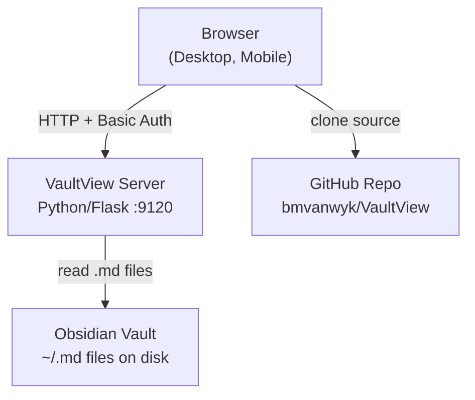
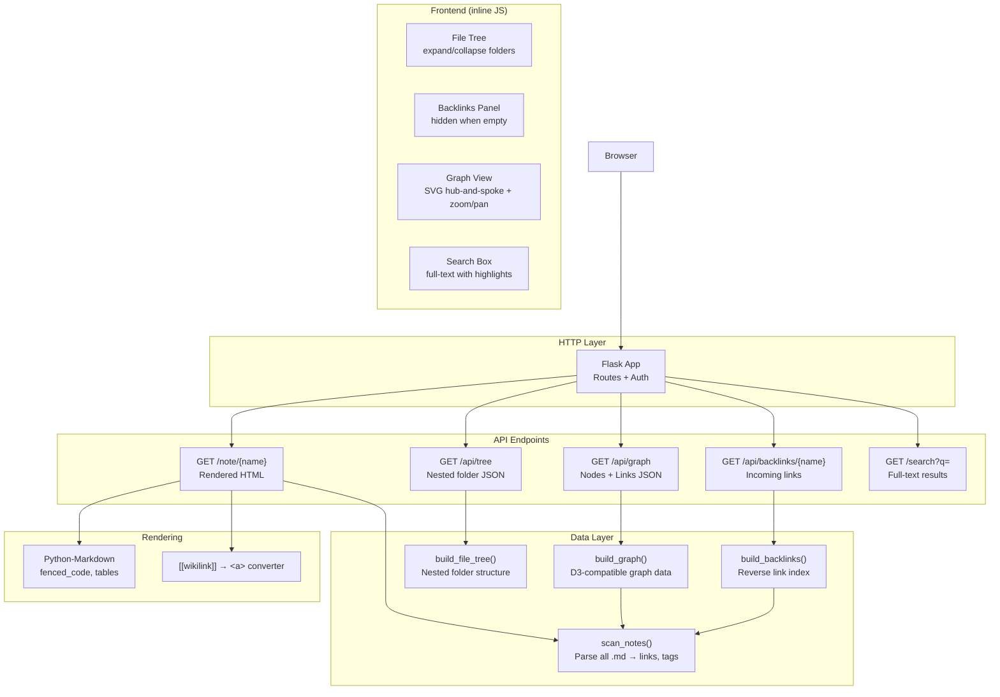
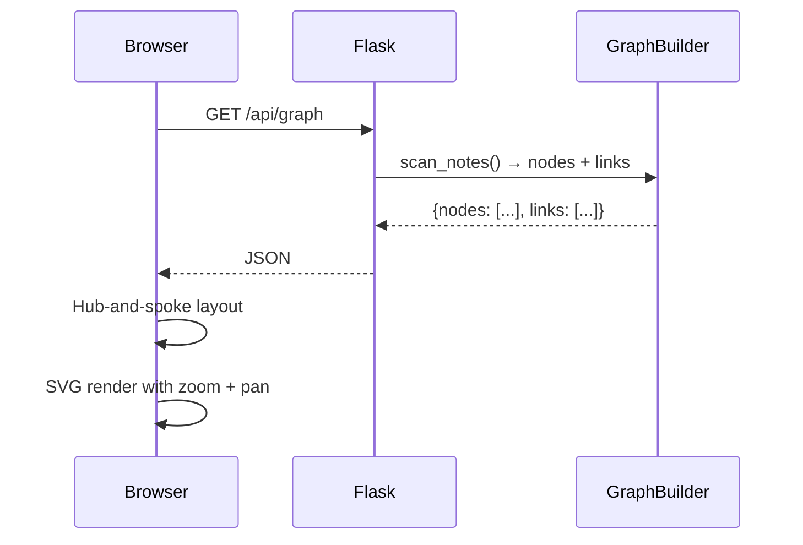

# Architecture — VaultView

## Design Intent

VaultView is a single-file, zero-dependency (beyond Flask + Python stdlib) web server that renders an Obsidian vault as a browsable website. It should stay intentionally small — one Python file, one HTML template (inline), vanilla JavaScript. No bundler, no frontend framework, no database. The vault filesystem IS the database.

The core tension: Obsidian Desktop is a rich editor with 1,500+ plugins. VaultView is a **read-optimized companion**. It should excel at browsing, linking, and visualizing — not editing.

---

## System Context



---

## Core Design Principles

1. **Filesystem is the database.** Notes are `.md` files on disk. No SQLite, no index — `Path.rglob("*.md")` is the query engine.

2. **Read-optimized, not an editor.** Rendering markdown and navigating links is the primary use case. Editing is out of scope for v1.

3. **Single-file deploy.** One `app.py`, one `requirements.txt`. `pip install -r requirements.txt && python3 app.py` should be the entire setup.

4. **Dark theme, mobile-friendly.** The UI adapts from desktop (3-column: file tree + content + backlinks) to narrow mobile layouts.

5. **API-first internals.** The frontend JavaScript calls `/api/graph`, `/api/tree`, `/api/backlinks/<note>` — the server pre-computes JSON. The browser just renders.

---

## Component Architecture



---

## Request Flow

### Page View

```mermaid
sequenceDiagram
    participant Browser
    participant Flask
    participant Scanner
    participant Markdown
    participant Vault

    Browser->>Flask: GET /note/Tax%202026
    Flask->>Scanner: scan_notes() → find "Tax 2026"
    Flask->>Vault: read Tax 2026.md
    Flask->>Markdown: convert to HTML
    Flask->>Flask: convert [[wikilinks]] to &lt;a&gt;
    Flask-->>Browser: Full HTML page with sidebar + backlinks
    Browser->>Browser: JS loads /api/backlinks/Tax 2026
    Browser->>Browser: JS renders backlinks panel
```

### Graph View



---

## Graph Layout Algorithm

The graph uses a **hub-and-spoke** layout, not a force simulation:

1. Count incoming + outgoing links per node
2. Node with most links = hub (or "Home" if it exists)
3. Hub placed at center
4. All other nodes arranged in a circle around it
5. Link thickness reflects hub→spoke vs spoke→spoke

This guarantees readability without simulation jitter. Zoom and pan via SVG `transform`.

---

## File Structure

```text
VaultView/
├── app.py              # Entire server — routes, API, inline HTML/JS/CSS
├── requirements.txt    # flask, markdown, pygments
├── LICENSE             # MIT
├── README.md           # Quick start + features
├── AGENTS.md           # AI assistant instructions
└── docs/
    └── architecture.md # This file
```

---

## State Model

VaultView is **stateless** — every request re-scans the vault filesystem. This is intentional:

| Decision | Why |
|----------|-----|
| No cache | Vault changes between requests (git sync, Hermes edits) |
| No database | Filesystem is the single source of truth |
| No sessions | Basic auth is stateless |
| No websockets | Polling is simpler for this scale |

For vaults under ~1,000 notes, re-scanning on every request is fast enough (< 100ms on modern hardware).

---

## Security Model

- **Basic auth** over HTTP (or HTTPS if behind a reverse proxy)
- Single user/password via environment variables
- No file writes — read-only vault access
- No path traversal — notes resolved against vault root only
- Designed for **LAN/home network** use, not public internet

---

## What This Design Chooses NOT to Do

- **No editing.** Obsidian Desktop handles that. VaultView is a viewer.
- **No real-time sync.** Poll GitHub or refresh the page.
- **No plugin system.** Keep it one file.
- **No search index.** `str.find()` is fast enough for small vaults.
- **No multi-user.** One password, one vault, one family.

---

## Future Directions (v2+)

- Markdown editing via CodeMirror
- Tag cloud / tag pages
- Daily notes calendar view
- Dark/light theme toggle
- HTTPS via Let's Encrypt
- Docker image
- Obsidian plugin compatibility (Dataview, etc.)
